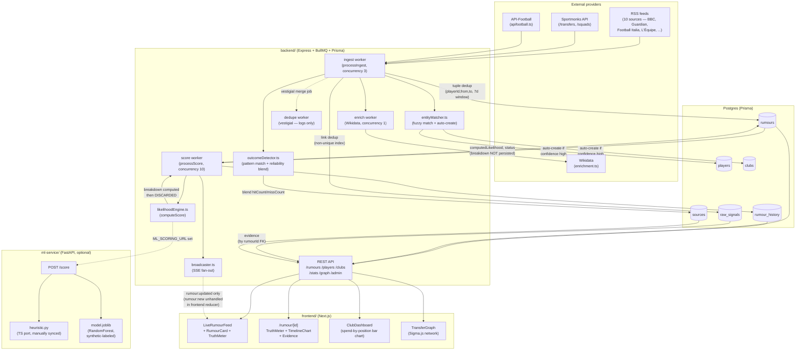

# Forecasting Audit — transfer-rumour-hub

Read-only audit. No code changed. All file:line references verified against
the working tree at commit `e9587d4` (2026-08-13). Every claim below was
checked by reading the cited file — nothing here is inferred from naming
conventions or the README alone. Uncertainties are marked **UNCERTAIN**.

---

## 1. Data entities

Source of truth: `backend/prisma/schema.prisma` (210 lines, 6 models + `WatchlistPlayer`/`User`, 4 enums).

| Concept in the request | Actual entity | Notes |
|---|---|---|
| Rumours | `Rumour` (schema.prisma:95-134) | The prediction record itself — see §1a |
| Sources | `Source` (schema.prisma:78-93) | One row per outlet, keyed by unique `name` string |
| Articles | `RawSignal` (schema.prisma:152-170) | Every ingested headline, matched or not — see §1b |
| Players | `Player` (schema.prisma:29-51) | |
| Clubs | `Club` (schema.prisma:10-27) | |
| Predictions | **No separate entity** | Prediction fields (`baseProbability`, `computedLikelihood`) live directly on `Rumour` — see §1a |
| Outcomes | **No separate entity** | Outcome is `Rumour.status` (terminal values `COMPLETED`/`FAILED`/`DENIED`) plus an append-only `RumourHistory` log — see §1c |

Also present, not asked about but load-bearing: `User`, `WatchlistPlayer` (auth/watchlists), enums `Position`, `SourceType`, `TransferWindow`, `RumourStatus`.

### 1a. `Rumour` is prediction + rumour fused into one row

`Rumour` (schema.prisma:95-134) carries the rumour's identity fields (`playerId`, `fromClubId`, `toClubId`, `sourceId`, `reportedFeeMin/Max`) **and** its current prediction state (`baseProbability` — raw provider probability, `computedLikelihood` — current 0–100 score, `status`) in the same row. There is no versioned "prediction" object independent of the rumour; a new score overwrites `computedLikelihood` in place (see §2).

`fromClubInferred` (schema.prisma:118) and `contradicts` (schema.prisma:120, self-FK) are notable: the schema already encodes two forms of epistemic uncertainty — "this fact was inferred, not asserted" and "this rumour conflicts with another one" — that a provenance/calibration rework should preserve, not replace.

### 1b. `RawSignal` is the article entity, but has no FK to `Source`

`RawSignal` (schema.prisma:152-170) stores `sourceName: String` (schema.prisma:154) — a denormalized copy of the outlet name — **not** `sourceId: Int` with a foreign key to `Source`. The actual `Source` row is looked up/created separately, by string-matching that same name, in `ensureSource()` (`backend/src/queue/workers.ts:20-27`). Nothing joins `RawSignal` to `Source` at the database level; the relationship only exists implicitly, by the two tables happening to store the same string independently.

Practical consequence: if a `Source.name` is ever edited (e.g. renamed `"BBC Sport"` → `"BBC Football"`), every historical `RawSignal.sourceName` for that outlet silently stops matching, and there is no way to ask "which `Source` produced this `RawSignal`" via a join — only via a second string-equality lookup that may now be stale. **This is the primary structural gap for "provenance-aware source ingestion" (§6a).**

### 1c. Outcome = `Rumour.status` + `RumourHistory`, no dedicated outcome record

`RumourStatus` enum (schema.prisma:203-209): `PENDING`, `HOT` (derived, likelihood ≥ 70), `COMPLETED`, `FAILED`, `DENIED`. Resolution logic lives in `backend/src/ingestion/outcomeDetector.ts:33-88` (`applyOutcome`): sets `Rumour.status`, force-sets `computedLikelihood` to 100 (COMPLETED) or 0 (FAILED/DENIED) (outcomeDetector.ts:52-53), appends one `RumourHistory` row, and updates `Source.hitCount`/`missCount`/`reliabilityScore` via a sample-size-weighted blend (outcomeDetector.ts:67-74).

There is no `RumourOutcome` table recording *when* a rumour was resolved independent of `updatedAt`, *what evidence* triggered the resolution (only inferable by cross-referencing `RawSignal.rumourId` + timestamp — no direct link from the resolution event to the specific triggering signal), or a *confidence/manual-vs-automatic* flag beyond the presence/absence of `force=true` in the `applyOutcome()` call (outcomeDetector.ts:37), which itself isn't persisted anywhere — an admin-forced correction (`backend/src/routes/admin.ts:16-29`) and an auto-detected outcome (`backend/src/queue/workers.ts:175-178`) look identical in the data afterward.

`ml-service/train.py:65-107` (`make_db_dataset`) already assumes it can read ground truth straight off `rumours.status IN ('COMPLETED','FAILED','DENIED')` — so the schema is *usable* for outcome labelling today, just without provenance on the label itself.

### 1d. "Corroboration" is a bare counter, not a set

`Rumour.distinctSourceCount` (schema.prisma:110) is a plain `Int`, incremented via Prisma's `{ increment: 1 }` in two places: `backend/src/queue/workers.ts:170` (RSS path) and `workers.ts:275` (Sportmonks path). **Neither increment site checks whether the new signal's source differs from previously-counted ones** — see §6b for why the field name overstates what it measures.

---

## 2. Where likelihood is calculated, persisted, rendered

**Calculated:** `backend/src/scoring/likelihoodEngine.ts:144-157` (`computeScore`). Tries `ML_SCORING_URL` (FastAPI, `ml-service/app/main.py:16-27`) first if set, falls back to the in-process heuristic (`heuristicScore`, likelihoodEngine.ts:73-134) on any error, timeout, or missing config (likelihoodEngine.ts:149-156). The Python heuristic (`ml-service/app/heuristic.py`) is a hand-ported duplicate of the TypeScript one — kept in sync manually (heuristic.py:11 docstring says so explicitly); **no shared source of truth, no test asserting the two stay identical**.

**Triggered from:** `backend/src/queue/workers.ts` — `processScore()` (workers.ts:311-354), a BullMQ worker (concurrency 10, workers.ts:392) consuming the `score` queue. Enqueued from `processIngest()` on every new or corroborated rumour (workers.ts:172, 197) and from `upsertNormalizedRumour()` for the Sportmonks path (workers.ts:283, 305).

**Persisted:** `Rumour.computedLikelihood` is overwritten in place (workers.ts:344-347) — no version history of the raw score itself, only of the *(score, status)* pair via `RumourHistory.create()` (workers.ts:348-350), which is what powers the timeline chart. `RumourStatus` flips to `HOT` at ≥ 70 (workers.ts:342), matching the constant documented in the `RumourStatus` enum comment (schema.prisma:205).

**The `breakdown` field (`ScoringOutput.breakdown`, likelihoodEngine.ts:41-48 / heuristic.py `ScoringBreakdown`) is computed on every call but discarded.** `processScore()` destructures only `{ score }` from `computeScore()`'s return (workers.ts:331,338) and never touches `.breakdown`. Confirmed via `grep -rn "breakdown" backend/src frontend/src`: the only other hits are the type definition and `likelihoodEngine.test.ts:40-44`, which asserts the breakdown components sum to ≤ 100 but never asserts anything is persisted. **This is the central gap for "explainable rumour detail UI" (§6e) — the explainability data already exists in memory at scoring time and is thrown away before it reaches the database.**

**Rendered:**
- `frontend/src/components/TruthMeter.tsx` — Recharts `RadialBarChart`, current `computedLikelihood` + `status` only (props: TruthMeter.tsx:7-11).
- `frontend/src/components/TimelineChart.tsx` — Recharts `LineChart` over `RumourHistoryPoint[]` (from `GET /rumours/:id`'s `history` field), with a dashed `ReferenceLine` at 70 marking the HOT threshold (TimelineChart.tsx:57).
- `frontend/src/components/ClubDashboard.tsx:24-30` — client-side aggregation of `computedLikelihood`-weighted expected spend by position, fed into a Recharts `BarChart`.
- `backend/src/routes/graph.ts` + `frontend/src/components/network/TransferGraph.tsx` — Sigma.js/graphology network view. `GET /graph` encodes `computedLikelihood` into edge `weight`/`size`/`color` server-side (graph.ts:87-92, 101-106); the frontend lays it out with `forceAtlas2` (TransferGraph.tsx:117-125).
- **No component renders `breakdown`.** `frontend/src/app/rumour/[id]/page.tsx` shows `TruthMeter`, `TimelineChart`, a static "Source" reliability line (rumour/[id]/page.tsx:62-72), and "Evidence" (raw article links, rumour/[id]/page.tsx:89-113) — but nothing decomposing *why* the score is what it is.

---

## 3. RSS ingestion deduplication — three layers, two of them race-prone

All logic lives in `backend/src/queue/workers.ts`, `processIngest()` (workers.ts:111-250).

1. **Signal-level, by URL.** `prisma.rawSignal.findFirst({ where: { link } })` (workers.ts:124-127) before creating a `RawSignal` row. Backed by `raw_signals_link_idx` (`backend/prisma/migrations/20260808183030_rss_link_dedup_index/migration.sql`) — **a plain non-unique index, not a `UNIQUE` constraint.** With the ingest worker's concurrency of 3 (workers.ts:391), two workers processing different feeds that both return a signal with the same `link` at nearly the same moment can both pass the `findFirst` check before either `create()` lands, producing two `RawSignal` rows for one URL. **UNCERTAIN whether this has been observed in practice** — no incident is documented, and it would only manifest under near-simultaneous cross-feed syndication of the exact same URL.

2. **Rumour-level, by entity tuple.** After entity extraction, `(playerId, fromClubId, toClubId)` is checked via `findFirst` within a rolling 7-day `rumourDate` window (workers.ts:157-164, and again for the Sportmonks path in `upsertNormalizedRumour`, workers.ts:263-270). If a match exists, no new `Rumour` is created — `distinctSourceCount` increments instead (workers.ts:168-171). Same non-unique-constraint caveat as above: this is an app-level TOCTOU check, not a DB-level guarantee, under the same concurrency:3 worker pool.

3. **The `dedupe` BullMQ queue is vestigial.** `processDedupe()` (workers.ts:358-360) only `console.log`s — the real merge decision already happened synchronously above, before the job was ever enqueued (workers.ts:277-282, only reached from the Sportmonks path; the RSS path never even calls it). The queue exists in `backend/src/queue/queues.ts` and is wired into `startWorkers()` (workers.ts:393) but does no work.

**No cross-URL, cross-outlet story-similarity dedup exists.** Two different outlets covering the same real-world transfer with different URLs are only deduplicated if entity extraction resolves both to the *identical* `(player, fromClub, toClub)` tuple; if one omits the origin club (common — see the outcome-fallback path, workers.ts:56-91), they can diverge into unrelated signal/rumour rows rather than being recognized as the same story. This is the mechanism §6b (independent corroboration) needs to build on, not replace.

---

## 4. Frontend components rendering scores/charts/timelines/graphs

| Component | File | Renders |
|---|---|---|
| `TruthMeter` | `frontend/src/components/TruthMeter.tsx` | Current score, radial gauge (Recharts `RadialBarChart`) |
| `TimelineChart` | `frontend/src/components/TimelineChart.tsx` | `RumourHistory` over time, line chart (Recharts `LineChart`) |
| `ClubDashboard` | `frontend/src/components/ClubDashboard.tsx` | Likelihood-weighted expected spend by position, bar chart (Recharts `BarChart`) |
| `TransferGraph` | `frontend/src/components/network/TransferGraph.tsx` | Player/club transfer network, force-directed graph (Sigma.js + graphology) |
| `RumourCard` | `frontend/src/components/RumourCard.tsx` | Embeds `TruthMeter`; manual (non-chart-lib) 5-dot source-reliability indicator (`ReliabilityDots`, RumourCard.tsx:32-44) |
| `LiveRumourFeed` | `frontend/src/components/LiveRumourFeed.tsx` | List of `RumourCard`s, live-patched via `useRumourFeed` (SSE) |

`frontend/src/lib/useRumourFeed.ts` is the SSE client: listens for `rumour:updated` events (useRumourFeed.ts:43-48) and patches `computedLikelihood`/`status` into local state via a reducer (useRumourFeed.ts:17-30) — **note it only handles the `UPDATE` action; the reducer has an unused `NEW` action type (useRumourFeed.ts:15) that no `dispatch` call ever fires**, so new rumours broadcast via the `rumour:new` SSE event (`backend/src/queue/workers.ts:208-215, 306`) never appear in an already-open feed without a manual refresh. **UNCERTAIN** whether this is intentional (rely on the 30s Next.js revalidation, `frontend/src/lib/api.ts:22`) or a bug — flagging as discovered, not fixing.

No component reads or renders `ScoringOutput.breakdown` (see §2) — confirmed by repo-wide grep, zero frontend hits.

---

## 5. Test coverage

**Backend — 4 files, unit-level only, all under `backend/src/`:**

| File | Tests | Covers |
|---|---|---|
| `scoring/likelihoodEngine.test.ts` | 7 | Heuristic scoring only. Does **not** exercise the `ML_SCORING_URL` code path, `breakdown` persistence, or the Python port for parity. |
| `ingestion/playerClubSync.test.ts` | 7 | `upsertPlayer`/`upsertClub` merge logic |
| `ingestion/sportmonksCatalog.test.ts` | 3 | Zod schema edge cases (added this session) |
| `ingestion/sources/rss.test.ts` | 4 | `isTransferRelated` keyword filter (added this session) |

Total: 21 tests, all passing as of this audit (verified via `npx vitest run` inside `backend/`).

**Not covered by any automated test:**
- `entityMatcher.ts` — the largest, most bug-dense file in the pipeline (726 lines; README §"Picking this up" explicitly documents "several rounds of real bugs found"). Its only regression tool is `entityMatcher.replay.ts`, which is **not a test suite**: no `describe`/`it`, no assertions, requires a live Postgres populated with the real player/club catalog, and is run manually via `npx tsx` with output meant to be eyeballed (entityMatcher.replay.ts:1-21, 137-152). Its own header comment says it exists *because* "vitest is currently broken in this env (rollup optional-dep issue)" — **that specific claim is now stale**: this session hit and fixed that exact `@rollup/rollup-darwin-arm64` optional-dependency bug via a clean `npm install` (unrelated task, same repo), and vitest now runs cleanly (21/21, confirmed above). Converting `entityMatcher.replay.ts`'s cases into real `vitest` assertions is now unblocked but wasn't done as part of this read-only audit.
- `outcomeDetector.ts` — pattern-matching (`COMPLETION_PATTERNS`/`FAILURE_PATTERNS`) and the reliability-blending formula (outcomeDetector.ts:67-74) have zero tests.
- `queue/workers.ts` — no test exercises `processIngest`, `processScore`, `linkContradiction`, or `applyOutcomeFallback` in isolation; all logic is only ever exercised by running the real dev server against real feeds (as done manually this session for the RSS-provider work).
- All `routes/`/`controllers/`/`services/` (rumours, clubs, players, stats, graph, admin) — zero tests.
- `ml-service/` — **no test files at all** (`find ml-service -iname "*test*"` returns nothing outside `venv/`). `train.py` has no unit tests for `to_feature_vector`, `make_synthetic_dataset`, or `make_db_dataset`; no test asserts `heuristic.py` and `likelihoodEngine.ts` stay numerically identical, despite the docstring's "keep in lockstep" requirement (heuristic.py:11).

**Frontend — zero test files.** `find frontend/src -iname "*.test.*" -o -iname "*.spec.*"` returns nothing. No test runner is even configured in `frontend/package.json` (**UNCERTAIN** — not exhaustively checked beyond the absence of test files and scripts named `test`).

---

## 6. Smallest safe implementation sequence

Ordered by dependency, not by importance — each step is buildable and mergeable without the ones after it, and (except where noted) without waiting on real user traffic.

### 6e. Explainable rumour detail UI — do this first

Purely additive, no data dependency, the source data (`breakdown`) already exists in memory at scoring time (§2) and just needs to survive past `processScore()`. Smallest safe slice:
1. Add a nullable JSON column to persist `breakdown` (schema/migration plan in §"Database migration plan" below) rather than 6 separate float columns — the shape is defined once in `ScoringOutput.breakdown` (likelihoodEngine.ts:41-48) and mirrored in Python (`schemas.py` `ScoringBreakdown`); a JSON column avoids a second migration if a 7th component is added later.
2. `processScore()` (workers.ts:331-350) passes `breakdown` through to both the `Rumour` update and the `RumourHistory.create()` call — this makes the breakdown *historical*, not just current, which the timeline chart can eventually use for "why did the score change" on hover.
3. `getRumourById`/the `GET /rumours/:id` response already round-trips whatever's on the row (`rumoursController.ts:35-44`, `rumoursService.ts:69-71`) — no controller change needed beyond the type, `RumourWithRelations` already derives from `Prisma.RumourGetPayload`.
4. New frontend component (e.g. `ScoreBreakdown.tsx`) rendered in `rumour/[id]/page.tsx` next to `TruthMeter` — a horizontal stacked bar or small bar chart of the 6 weighted components, matching the existing Recharts usage pattern in `TimelineChart`/`ClubDashboard`.

No behavior change to scoring itself, no backward-compat risk beyond an additive nullable column.

### 6a. Provenance-aware source ingestion

Depends on nothing above. Two independent fixes, both schema-additive:
1. Add `RawSignal.sourceId Int?` with a real FK to `Source`, populated at the same call site that currently resolves `sourceId` via `ensureSource()` (workers.ts:151, already has the value in scope before `RawSignal.create()` at workers.ts:130 — just needs reordering so `ensureSource()` runs first and its result is included in the `create()` payload). Keep `sourceName` for now (don't break existing reads) but stop treating it as the join key.
2. Turn the two non-unique indexes into real constraints: `UNIQUE` on `raw_signals.link` (closes the race in §3.1) and a partial/compound uniqueness guard on the `(playerId, fromClubId, toClubId, rumourDate-bucket)` lookup in §3.2 — **UNCERTAIN** exact constraint shape without knowing whether Postgres partial/expression indexes are acceptable here vs. an application-level advisory lock; flagging as a design decision, not resolving it in this audit.

### 6b. Independent corroboration — depends on 6a

`distinctSourceCount`'s increment sites (workers.ts:170, 275) need to check the *new* signal's `sourceId` against the set of `sourceId`s already backing that rumour's existing `RawSignal.rumourId` links, and only increment on a genuinely new one. This requires 6a's `RawSignal.sourceId` FK to exist first — without it, "which sources already corroborated this rumour" can only be answered by re-parsing `sourceName` strings, which is exactly the fragility 6a removes. Rename or leave `distinctSourceCount` as-is but fix its semantics — **flagging as a decision for whoever implements this**, not resolving it here (renaming is a breaking API-contract change per §"API contract changes" below; fixing semantics without renaming is not).

### 6c. Historical outcome labelling — schema work is safe now, real training is not

The schema addition (a proper outcome/resolution record — see migration plan) can be built today, independent of data volume. Training on it cannot: `ml-service/train.py:31` (`MIN_REAL_SAMPLES = 200`) already refuses to run `--source db` below that threshold, and the README states the dev DB currently has 6 rumours total (README.md:159, dated 2026-08-12) — **UNCERTAIN whether this count has grown materially since**; not re-verified in this audit since it would require querying a live DB and this audit is read-only-on-code, but the schema-level blocker is real regardless of the exact current count. Sequence: ship the schema + the `applyOutcome()` write-path change now; treat the actual retraining trigger as a follow-up gated on the 200-row threshold, exactly as `train.py` already enforces.

### 6d. Calibrated probabilities — depends on 6c's data existing

`computedLikelihood` is presented as if it's a probability (rendered as `X%` throughout the UI — TruthMeter.tsx, ClubDashboard.tsx) but nothing calibrates it: `outcomeDetector.ts`'s blend (outcomeDetector.ts:67-74) recalibrates *source reliability*, not the *score itself*, against outcomes. Building an actual calibration step (e.g. isotonic regression fit on `(computedLikelihood_at_resolution_time, outcome)` pairs) needs the same resolved-outcome volume as 6c and is blocked by the same 200-row threshold. This is the only item in the sequence that cannot be meaningfully de-risked by writing more code today — it is fundamentally data-gated, not implementation-gated.

**Summary ordering:** 6e → 6a → 6b → 6c (schema now, training later) → 6d (blocked on 6c's data).

---

## Current architecture

---

## File-by-file change plan

Grouped by the sequence in §6. Every file listed was read in full during this audit.

### 6e — Explainable rumour detail UI

| File | Change |
|---|---|
| `backend/prisma/schema.prisma` | Add `breakdown Json?` to `Rumour` (schema.prisma:95-134, alongside `computedLikelihood`) and to `RumourHistory` (schema.prisma:137-148) |
| `backend/src/scoring/likelihoodEngine.ts` | No change — `ScoringOutput.breakdown` already has the right shape (likelihoodEngine.ts:41-48) |
| `backend/src/queue/workers.ts` | `processScore()` (workers.ts:331-350): destructure `{ score, breakdown }`, include `breakdown` in both the `rumour.update()` (workers.ts:344-347) and `rumourHistory.create()` (workers.ts:348-350) payloads |
| `backend/src/services/rumoursService.ts` | No change — `rumourInclude` (rumoursService.ts:5-10) already selects whole rows; `breakdown` rides along automatically once it's a column |
| `frontend/src/types/index.ts` | Add `breakdown` field to `Rumour`/`RumourHistoryPoint` interfaces (types/index.ts:35-57) |
| `frontend/src/components/` (new file, e.g. `ScoreBreakdown.tsx`) | New component, same pattern as `TimelineChart.tsx`/`ClubDashboard.tsx` (client component, `mounted` gate to avoid SSR hydration mismatch like `TruthMeter.tsx:36-58`) |
| `frontend/src/app/rumour/[id]/page.tsx` | Render new component near the existing `TruthMeter` (rumour/[id]/page.tsx:24-30) |

### 6a — Provenance-aware source ingestion

| File | Change |
|---|---|
| `backend/prisma/schema.prisma` | Add `RawSignal.sourceId Int?` + relation to `Source` (schema.prisma:152-170); add `@@unique([link])` in place of the current plain `@@index([link])` (schema.prisma:168) |
| `backend/src/queue/workers.ts` | `processIngest()` RSS branch (workers.ts:111-250): move the `ensureSource()` call (currently workers.ts:151, after `RawSignal.create()` at workers.ts:130) before the `RawSignal.create()` call, and pass `sourceId` into its `data` payload |
| `backend/src/queue/workers.ts` | Decide and implement the race-condition fix for the tuple-dedup check (§3.2) — options: Postgres advisory lock keyed on the tuple, or a real unique constraint plus `upsert`-with-catch. Not resolved in this audit — flagged as a design decision |

### 6b — Independent corroboration (depends on 6a)

| File | Change |
|---|---|
| `backend/src/queue/workers.ts` | Both `distinctSourceCount` increment sites (workers.ts:170, 275): replace unconditional `{ increment: 1 }` with a query for distinct `sourceId`s among the rumour's linked `RawSignal`s, incrementing only when the new `sourceId` isn't already present |
| `backend/src/scoring/likelihoodEngine.ts` / `ml-service/app/heuristic.py` | No change needed — both already consume `distinctSourceCount` as an opaque number (likelihoodEngine.ts:110-113); fixing its semantics upstream doesn't require touching the consumer |

### 6c — Historical outcome labelling

| File | Change |
|---|---|
| `backend/prisma/schema.prisma` | New model, e.g. `RumourOutcome` (rumourId FK, resolvedAt, method: enum `AUTO_DETECTED \| ADMIN_FORCED`, triggeringSignalId: Int? FK to RawSignal) |
| `backend/src/ingestion/outcomeDetector.ts` | `applyOutcome()` (outcomeDetector.ts:33-88): create a `RumourOutcome` row alongside the existing `RumourHistory` row (outcomeDetector.ts:59-61), threading through the `force` param (already present, outcomeDetector.ts:37) as the `method` field |
| `backend/src/routes/admin.ts` | No change — already calls `applyOutcome(..., true)` (admin.ts:23), which is exactly the signal `outcomeDetector.ts` needs to set `method: ADMIN_FORCED` |
| `ml-service/train.py` | `make_db_dataset()` (train.py:65-107): once `RumourOutcome` exists, can join on it for a real `resolvedAt`-based feature (e.g. days-to-resolution) instead of approximating with `createdAt` (train.py:98, current approximation) |

### 6d — Calibrated probabilities (blocked on 6c's data volume)

No file changes proposed here — this step is data-gated, not code-gated (§6d). When unblocked, the natural home is a new module (e.g. `backend/src/scoring/calibration.ts`) that wraps `computeScore()`'s output, using `RumourOutcome` rows as ground truth. Deferred.

---

## Database migration plan

Ordered to match §6, each independently deployable and backward-compatible (all additive, no column removals/renames):

1. **`add_score_breakdown`** — `ALTER TABLE rumours ADD COLUMN breakdown JSONB;` `ALTER TABLE rumour_history ADD COLUMN breakdown JSONB;`. Nullable — existing rows unaffected, existing reads unaffected (Prisma `select *`-equivalent behavior already used throughout `rumoursService.ts`).
2. **`add_raw_signal_source_fk`** — `ALTER TABLE raw_signals ADD COLUMN "sourceId" INTEGER REFERENCES sources(id);` Nullable initially (existing rows have no resolved `sourceId`); a backfill script (not a migration — data migration, run once via `tsx`) can populate it retroactively by re-resolving `sourceName` → `Source.id` for historical rows, matching the pattern already used for the contractEnd backfill this session (`POST /admin/players/sync`'s in-place update path).
3. **`raw_signals_link_unique`** — replace `raw_signals_link_idx` (from `20260808183030_rss_link_dedup_index`) with a `UNIQUE` constraint. **Prerequisite check before this migration is safe to write:** confirm no duplicate `link` values already exist (`SELECT link, count(*) FROM raw_signals GROUP BY link HAVING count(*) > 1`) — if the race in §3.1 has ever fired, this migration fails until those duplicates are manually resolved. **UNCERTAIN** whether duplicates currently exist; not checked in this read-only audit (would require a live DB query against data, not code).
4. **`add_rumour_outcome`** — new table `rumour_outcomes` (id, rumourId FK unique — one outcome per rumour, resolvedAt, method enum, triggeringSignalId FK nullable, createdAt). Purely additive.

No migration in this plan requires a maintenance window or backfill that blocks reads/writes — all are `ADD COLUMN`/`CREATE TABLE`, safe under Postgres's online-DDL behavior for these operation types on a table this size (dev DB: single-digit rumour count per README.md:159, **UNCERTAIN** current production/staging table sizes since none were found — no deploy config, staging environment, or production DB reference exists anywhere in the repo, env files, or README).

---

## API contract changes

| Endpoint | Change | Backward-compat |
|---|---|---|
| `GET /rumours/:id` | Response gains `breakdown: { source, contract, feeAlignment, clubNeed, sourceCount, providerBonus } \| null` on the top-level object and on each `history[]` entry | Additive field — existing consumers (`frontend/src/lib/api.ts:63`, typed as `RumourDetail`) ignore unknown fields by default in TS unless a type is `exact`; **UNCERTAIN** whether any consumer outside this repo exists (no mobile app yet per README.md:162, no other API client found) |
| `GET /rumours`, `GET /clubs/:id`, `GET /graph` | No change proposed — `breakdown` is detail-view-only in this plan; if `TransferGraph`'s edge tooltip should eventually show it, `graph.ts:81-93` would need the same additive field |
| `POST /admin/rumours/:id/outcome` (`admin.ts:16-29`) | No request/response shape change — `method: ADMIN_FORCED` is inferred server-side from `applyOutcome(..., true)` already being called from this route, not from a new request field |
| — | **No breaking change proposed anywhere in §6a–6e.** `distinctSourceCount`'s *semantics* change (6b) without a *name* or *type* change is a silent behavior change to API consumers that currently read it as "number of times corroborated" rather than "number of distinct sources" — flagged as worth a release note even though the wire contract (an `Int` field) doesn't change. |

---

## Test plan

Matches the coverage gaps in §5.

| Area | New tests | Rationale |
|---|---|---|
| `likelihoodEngine.ts` | Assert `breakdown` is returned unchanged whether via heuristic or (mocked) ML path; assert `heuristicScore` and `ml-service/app/heuristic.py`'s output match for a shared fixture set (requires a small cross-language harness — e.g. a JSON fixture file both a vitest test and a pytest test load) | Closes the "manually kept in lockstep" gap (heuristic.py:11) |
| `workers.ts::processScore` | New test file (currently none) asserting `breakdown` round-trips into both `Rumour` and `RumourHistory` on update | Directly verifies 6e |
| `workers.ts::processIngest` (dedup) | New test file asserting: (a) two signals with the same `link` produce one `RawSignal`; (b) two signals resolving to the same tuple increment `distinctSourceCount` **once** when from the same source, **twice** when from different sources (post-6b) | Directly verifies 6a/6b; currently zero coverage on this path at all |
| `entityMatcher.ts` | Convert `entityMatcher.replay.ts`'s `BAD_CASES`/`GOOD_CASES` (14 real cases, entityMatcher.replay.ts:24-135) into real `vitest` assertions now that vitest is confirmed working in this environment (§5) | Currently the single largest test-coverage gap relative to bug density; not part of §6's sequence but flagged as independently worth doing given it's now unblocked |
| `outcomeDetector.ts` | New test file: pattern-match cases for each `COMPLETION_PATTERNS`/`FAILURE_PATTERNS` entry (outcomeDetector.ts:3-25); reliability-blend formula at known sample sizes (outcomeDetector.ts:67-74) | Zero current coverage |
| `RumourOutcome` (new, 6c) | New test asserting `applyOutcome()` creates exactly one `RumourOutcome` row, with `method` set correctly for both admin-forced and auto-detected paths | Directly verifies 6c |
| `ml-service/` | New `pytest` suite (currently zero test files) for `to_feature_vector` (model.py:36-51, especially the missing-flag encoding) and `make_synthetic_dataset`/`make_db_dataset` (train.py:38-107) | Zero current coverage on the only place `RumourOutcome`'s eventual training data gets consumed |
| Frontend | New component test for the `breakdown` renderer (6e) — first frontend test in the repo, so this also means picking and configuring a test runner (**not currently present**, per §5) | Zero current coverage, decision needed on runner (Vitest + Testing Library is the natural fit given the backend already uses Vitest) |

---

## Risks and backward-compatibility concerns

- **`entityMatcher.ts` is the highest-risk file to touch and isn't covered by anything proposed in §6.** Any of 6a/6b's changes to `workers.ts` sit downstream of `extractRumoursFromText()`'s output and don't modify it, but a reviewer should confirm that assumption holds once the actual diffs exist — this audit only establishes the current boundary, not that future changes will respect it.
- **The `raw_signals_link_unique` migration (§"Database migration plan" item 3) can fail outright** if the race condition in §3.1 has ever produced duplicate `link` values. This must be checked against real data before the migration is written, not assumed safe from the code alone.
- **`distinctSourceCount`'s semantics change (6b) is a silent behavior change**, not a schema change — anything downstream reading it (the heuristic engine's `sourceCount` weight, likelihoodEngine.ts:110-113; the ML feature vector, model.py `distinctSourceCount`) will see systematically lower values after the fix for any rumour previously corroborated by repeat signals from the same outlet. This will shift `computedLikelihood` downward for those rumours on their next `processScore()` run — worth a one-time note when 6b ships, even though no migration or API contract technically changes.
- **6d (calibration) cannot be safely implemented against synthetic data.** `ml-service/train.py`'s own `MIN_REAL_SAMPLES = 200` guard (train.py:31) already encodes this constraint for model training; the same constraint applies with more force to calibration, which is meaningless without real resolved outcomes. Attempting it early would produce a calibration curve fit to heuristic-labeled synthetic data — calibrating the heuristic against itself, not against reality.
- **No staging/production environment reference exists anywhere in the repo** — env files (`backend/.env.example`, `frontend/.env.example`) only define local defaults, no deploy config, no CI workflow file was found (**UNCERTAIN** — not exhaustively searched for CI config outside the standard locations; `.github/` was not confirmed present or absent in this audit). All risk assessments above assume a single dev database matching the ~6-rumour scale README.md:159 describes; if a larger environment exists elsewhere, the migration-safety and race-condition risk levels above should be re-assessed against its actual scale before any migration ships.
- **The Python/TypeScript heuristic duplication (heuristic.py / likelihoodEngine.ts) is a standing drift risk independent of this plan.** Nothing in §6 fixes it (a shared-schema/codegen approach was considered out of scope for "smallest safe sequence"); flagging it since 6e's breakdown-persistence work touches both files' output shape and is a natural moment to at least add the cross-language parity test proposed in the test plan, even if not the deeper fix.
